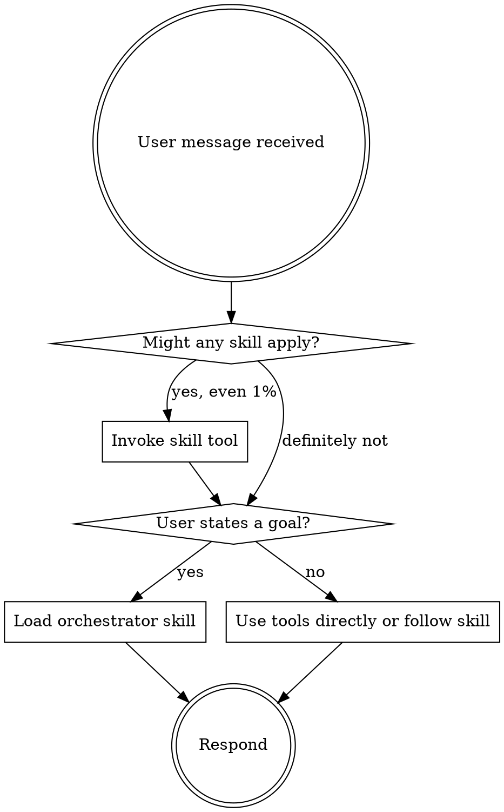

<SUBAGENT-STOP>
If you were dispatched as a subagent to execute a specific task, skip this skill.
</SUBAGENT-STOP>

<EXTREMELY-IMPORTANT>
If you think there is even a 1% chance a skill or tool might apply to what you are doing, you ABSOLUTELY MUST invoke or use it.

IF A SKILL APPLIES TO YOUR TASK, YOU DO NOT HAVE A CHOICE. YOU MUST USE IT.

This is not negotiable. This is not optional. You cannot rationalize your way out of this.
</EXTREMELY-IMPORTANT>

## Instruction Priority

1. **User's explicit instructions** (CLAUDE.md, AGENTS.md, direct requests) — highest priority
2. **Regent skills** — override default system behavior where they conflict
3. **Default system prompt** — lowest priority

User instructions say WHAT, not HOW. "Add X" or "Fix Y" doesn't mean skip workflows.

## The Rule

Skill check comes BEFORE any response or action. Even a 1% chance a skill or tool might apply means you check first. If it turns out to be wrong for the situation, you don't need to use it.

## Red Flags

These thoughts mean STOP — you're rationalizing:

| Thought | Reality |
|---------|---------|
| "This is just a simple question" | Questions are tasks. Check for skills. |
| "I need more context first" | Skill check comes BEFORE clarifying questions. |
| "Let me explore the codebase first" | Skills tell you HOW to explore. Check first. |
| "This doesn't need a formal skill" | If a skill exists, use it. |
| "I remember this skill" | Skills evolve. Read current version. |
| "I'll just do this one thing first" | Check BEFORE doing anything. |
| "This feels productive" | Undisciplined action wastes time. Skills prevent this. |

## Loadable Skills

Regent ships with these skills. Load them when relevant:

| Skill | When to Load |
|-------|-------------|
| `orchestrator` | User states a goal — 5-phase pipeline |
| `tdd` | Writing implementation code — red-green-refactor |
| `diagnose` | Bug, test failure — feedback loop debugging |
| `verification-before-completion` | Before claiming work done — evidence gate |

## Tool Catalog

Regent registers 5 custom tools:

| Tool | When to Use |
|------|-------------|
| `delegate` | One well-defined task for one subagent |
| `delegate_many` | Multiple independent tasks — runs them in parallel |
| `research` | Investigate questions, technologies, or approaches |
| `explore` | Understand codebase structure before planning |
| `verify` | Check implementation against requirements |

## Commands

| Command | What it does |
|---------|-------------|
| `/orchestrate <goal>` | Full 5-phase pipeline (clarify → plan → execute → verify → report) |
| `/delegate <task>` | Quick one-off delegation to a subagent |
| `/research <topic>` | Parallel research via subagents |
| `/tdd <feature>` | TDD red-green-refactor cycle |
| `/diagnose <symptom>` | Systematic debugging with feedback loop |
| `/verify <scope>` | Compliance check against requirements |

## Orchestrator vs Direct Tools

If the user states a goal ("build X", "create Y", "implement Z"), load the orchestrator skill. It handles the full pipeline.

If the user asks for one specific operation ("delegate this task", "research this topic"), use the tools directly.

## Tool Mapping for OpenCode

When skills reference tools from other platforms:
- `TodoWrite` → `todowrite`
- `Task` → `task` (OpenCode's task tool)
- `Read`, `Write`, `Edit`, `Bash` → Your native tools

Use OpenCode's native `skill` tool to list and load skills.
